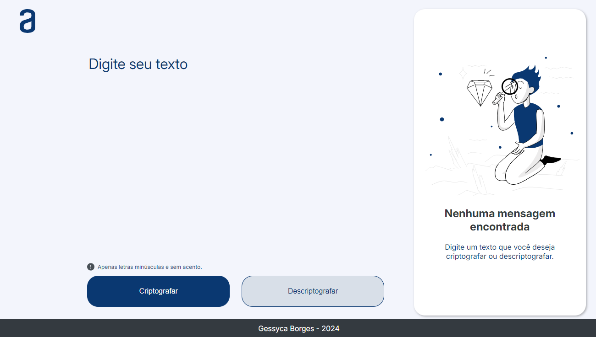

Projeto desenvolvido como um desafio do programa ONE, uma parceria entre a Alura e a Oracle. O objetivo do desafio foi criar uma aplicação web simples para codificar e decodificar texto usando HTML, CSS e JavaScript.

## Funcionalidades

- **Criptografia de Texto**: Converte letras específicas em cadeias de caracteres definidas.
- **Descriptografia de Texto**: Reverte o texto criptografado de volta ao texto original.
- **Cópia para Área de Transferência**: Permite copiar o texto resultante para a área de transferência com um clique.

## Tecnologias Utilizadas

- **HTML**: Estrutura básica da página.
- **CSS**: Estilização da página.
- **JavaScript**: Lógica para criptografia, descriptografia e manipulação do DOM.

## Como Usar

1. **Acesse o Projeto**: Você pode visualizar o projeto em [GitHub Pages](https://gessycaborges.github.io/challenge-decodificador-de-texto/).
2. **Digite o Texto**: Insira o texto que deseja criptografar ou descriptografar na área de texto fornecida.
3. **Escolha a Ação**: Clique em "Criptografar" para converter o texto ou em "Descriptografar" para reverter o texto criptografado.
4. **Copie o Texto**: Após a conversão, você pode clicar no botão "Copiar" para copiar o texto resultante.

## Estrutura do Projeto

- `index.html`: Arquivo principal com a estrutura da página.
- `style.css`: Arquivo de estilos para a página.
- `app.js`: Arquivo JavaScript com a lógica de criptografia, descriptografia e manipulação do DOM.
- `/assets/`: Pasta contendo imagens utilizadas no projeto.

## Link para o Protótipo no Figma

Você pode visualizar o protótipo do projeto no Figma [aqui](https://www.figma.com/design/tvFEYhVfZTjdJ5P24RGV21/Alura-Challenge---Desafio-1---L%C3%B3gica?node-id=0-1).

## Prévia

## Contribuições

Se você deseja contribuir para o projeto, sinta-se à vontade para abrir um issue ou pull request. Qualquer feedback é bem-vindo!

## Autora

<a href="https://www.linkedin.com/in/gessycaborges/">
  
 <a>Gessyca Borges</a></a> 
  
